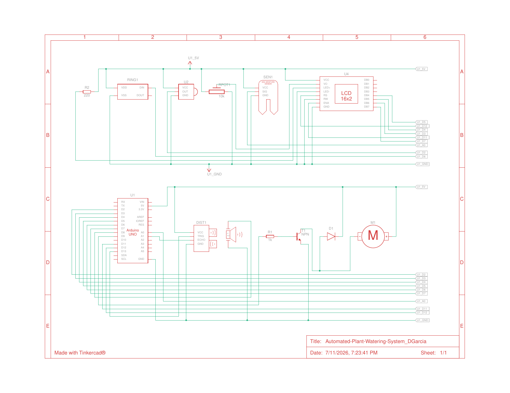

# Automated Plant Watering System

Closed-loop irrigation controller on an Arduino Uno: soil moisture sensing, tank-level checking, PWM pump control with a hard safety interlock, and a full user interface.

**Course:** RBT173 Final Project · **Tools:** Arduino (C++), Tinkercad

**Demo:** [Watch on YouTube](https://youtu.be/2ygz2bNcn00) · **Circuit:** [View simulation on Tinkercad](https://www.tinkercad.com/things/7gsBsYAITEZ-automated-plant-watering-systemdgarcia?sharecode=C7dVHyBCQLeq5HGPhjw784wfwkdzT5BW_h0Rv518O4M)

## Degree Objective

**Objective 1 — Design and complete robotic and embedded systems solutions that address real-world situations and challenges.**

Over- and under-watering is a real problem in agriculture and home growing. This system waters only when the soil actually needs it, refuses to run the pump dry, and tells the user exactly what it is doing at all times.

## How It Works

The controller averages eight soil-moisture ADC samples, maps them to a calibrated 0–100% scale, and compares against a user-adjustable threshold. An HC-SR04 ultrasonic sensor checks reservoir level with 1 cm of hysteresis to prevent flicker at the boundary. When moisture drops below threshold and the tank is OK, the pump runs for a timed cycle with PWM soft start/stop through an NPN low-side driver with a flyback diode. A 16x2 LCD reports mode, moisture, threshold, raw ADC, and tank status; a 16-pixel NeoPixel ring shows system state at a glance; an NEC IR remote handles mode, manual watering, and threshold changes.

## Engineering Highlights

- **Safety interlock:** the pump cannot start — in AUTO or manual — while the tank reads LOW, and it stops immediately if the tank goes LOW mid-cycle. No dry running.
- **Fully non-blocking:** all timing runs on `millis()`, so the IR receiver, LCD, and animations stay responsive while the control loop runs.
- **Real debugging under constraints:** NeoPixel refreshes were starving the IR decoder (the library disables interrupts during `show()`). I throttled LED frames to ~90 ms and rewrote the watering animation, which fixed remote responsiveness. `tone()` conflicted with IR timing, so I replaced it with a manual 2 kHz piezo toggle.
- **Robust IR handling:** matches multiple NEC code variants (24-bit families, RAW32 byte orders, 8-bit fallbacks) so different remotes work.

## Schematic

Full system schematic: soil moisture sensor, HC-SR04 ultrasonic tank sensor, 16x2 LCD with contrast pot, NeoPixel ring, IR receiver, piezo, and the NPN low-side pump driver with flyback diode.

## Files

- `plant_watering_system.ino` — full commented source (~500 lines)
- `plant-watering-system_schematic.png` — circuit schematic (Tinkercad)

## Links

- Demo video: https://youtu.be/2ygz2bNcn00
- Tinkercad simulation: [Automated Plant Watering System](https://www.tinkercad.com/things/7gsBsYAITEZ-automated-plant-watering-systemdgarcia?sharecode=C7dVHyBCQLeq5HGPhjw784wfwkdzT5BW_h0Rv518O4M)
- Portfolio: https://www.garciarobotics.com/
